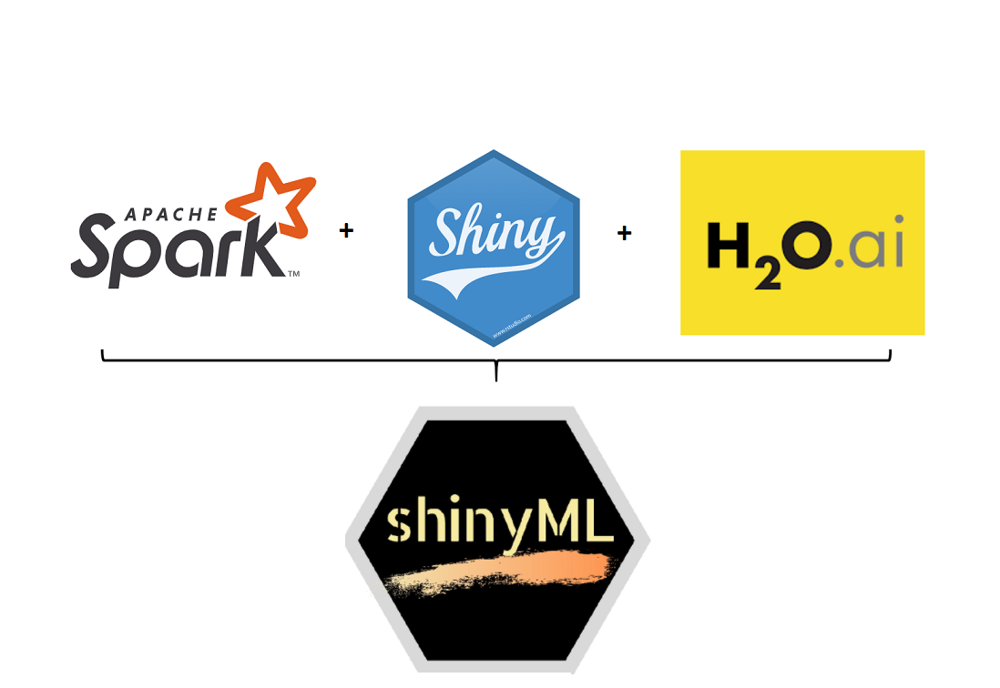

Compare Spark and h2o supervised regression techniques in a shareable
web app
================

[](https://travis-ci.org/JeanBertinR/shinyML)
[](https://ci.appveyor.com/project/JeanBertinR/shinyML)
[](https://codecov.io/github/JeanBertinR/shinyML?branch=master)

# dashR

Implement in one line of code a shareable web app to compare supervised
machine learning regression models\!

With `shinyML`, you can compare your favorite regression models issued
from H2O or Spark frameworks without any effort.

## Installation

You can install the released version of dashR from
[CRAN](https://CRAN.R-project.org) with:

``` r
install.packages("shinyML")
```

You can also install the latest development version from github:

``` r
devtools::install_github("JeanBertinR/shinyML", ref="develop")
```

## Getting started: create the shinyML web app in just one list of code

This is a basic example which shows you how to run the app:

``` r
library(shinyML)
longley2 <- longley %>% mutate(Year = as.Date(as.character(Year),format = "%Y"))
shiny_h2o(data =longley2,x = c("GNP_deflator","Unemployed" ,"Armed_Forces","Employed"),y = "GNP",date_column = "Year",share_app = TRUE,port = 3951)
```

## Test different machine learning techiques and hyper-parameters configurations with just a few clicks



First step consist in choosing separating train and test period from
your dataset: this can be done in one second using slider button on the
right of your shinyML app. You can also remove variables from your
initial selection directly from app just simply using “Input variable”
textbox. You are then free to select hyper-parameters configuration for
your favorite machine learning model.  
Note that hidden layers of deep learning technique can be set inside the
corresponding text box: the default c(200,200) configuration corresponds
to a two hiden-layers neural network, with neurons for each layers.


## Run at the same time all machine learning techniques to compare variable importances and error metrics

You can easily use `shinyML` package to compare the four machine
learning techniques with your own hyper-parameters configuration. For
that, you will just need to use shiny app buttons corresponding to your
parameters and click then to “Run tuned models \!”


You will see a validation message box once all models have been trained:
at that point, you can have an overview of your results comparing
variables importances and error metrics like MAPE or
RMSE.

## Run autoML alogrithm to find automatically configure the best machine learning regression model associated to your dataset

AutoML algorithm will automatically find the best algorithm to suit your
regression task: the user will be informed of the machine learning
technique used and know which hyper-parameters should be configured.

The only setting that must be adjusted by the user is the maximum time
authorized for searching.


For more information take a look at the [package
vignette](vignettes/vignettes.Rmd).
